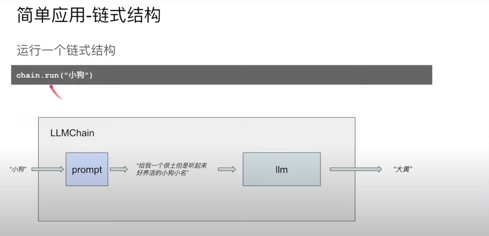

chat model 模塊和 llm 模塊的差別

簡單情況中他們是一樣的，但在複雜需求 chat model 更能符合

---

## 簡單應用 | 鏈式結構

為什麼要用鏈式結構？
方便連接多個 LLM 模塊

如何避免重複定義相似的 LLM 模塊？
提示模板(prompt template)

## 簡單應用 | 代理人

為什麼需要代理人？

- 處理鏈式模式難以處理的複雜問題
- 動態決策

ex. 算數問題, 聊天紀錄

本質：

- 對於一個任務，用語言模型來決定完成任務所需的行為以及實施這些行為的數據

行為方式：

代理人行為可以使用一系列預設工具(tools)

- 選擇工具
- 使用工具
- 觀測並處理工具使用的結果
- 重複以上步驟