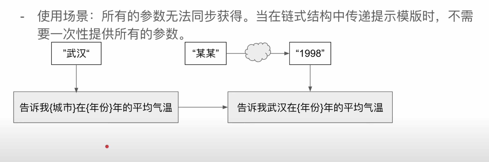
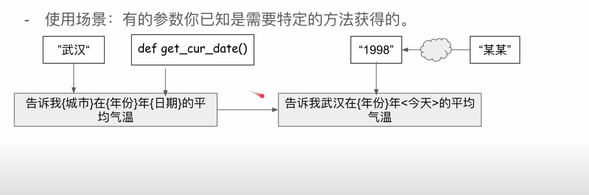
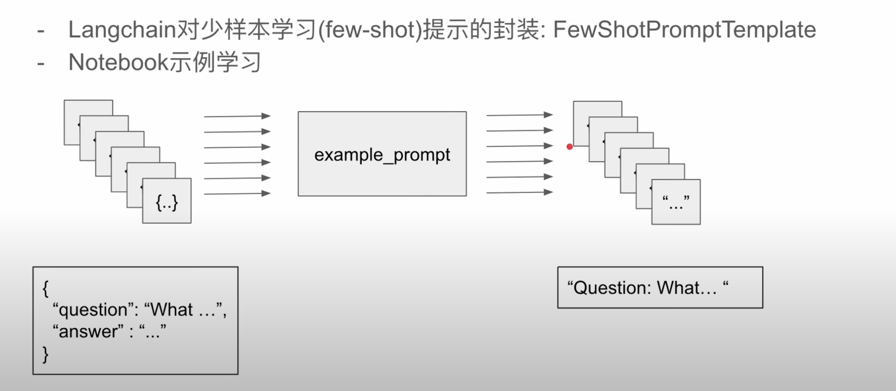
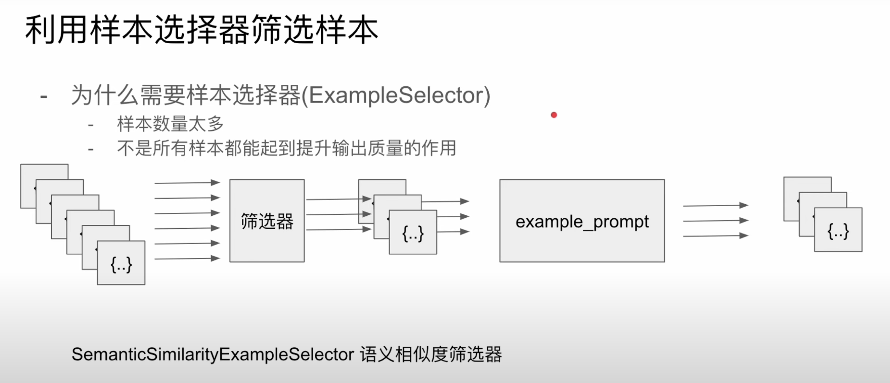

# model

## 與語言模型交互的"編碼方式" -- 提示（prompt）

- 精確的提示 -> 理想的結果
- 冗余的提示 -> 穩定的結果

語言模型有發

Lang chain 對提示詞的封裝 -> 提示模板(prompt template)

提示模板可以包括：

- 對語言模型的指令
- 提供一些簡單的範例，給語言模型從而使模型輸出更接近理想的結果
- 提給語言模型的問題

### 接收部分參數的提示模板

範例：知道特定明星出生時特定城市的氣溫

### 提供示例給語言模型從而實現邏輯思維

少樣本學習（few-shot learning）：
（給語言模型的思維慣性）

- 通過少量樣本（案例）讓語言模型學會處理某特定類型的問題
- 和對語言模型本身微調（fine-tuning）不同，少樣本學習不需要大量的樣本

例子：

- "你好嗎？" -> "帥哥，我很好"
- "今天禮拜幾？" -> "帥哥，今天是禮拜五"
- "今天天氣如何？" -> "帥哥，今天天氣晴朗"
- "我放了別人鴿子？" -> ?

Ans: "帥哥，你真狗"

---

### 利用樣本選擇器篩選樣本

篩選器功能：

- 增加精準度
- 節省時間
- 縮減提示詞總長度（省錢）

SemanticSimilarityExampleSelector 語意相似度篩選器 -> 用來篩選樣本

## 總結

大型語言模型封裝：llm 模塊

- lang chain 不提供現成的大語言模型
- lang chain 只提供針對不同語言模型的標準化接口

llm 模塊基本用法：

- 直接調用
  - 功能上類似 `predict` 方法，讓 llm 模塊根據輸入續寫文本
- 批量生成
  - generate()
  - 輸入：文本的列表
  - 輸出：文本的列表

### 自定義 llm 模塊

- 用於封裝 Lang chain 尚未支持的語言模型
- 用來模擬測試
- 定義當該 llm 模塊調用時，如何根據文本輸出

使用場景：如果某個模型很貴，你又大概知道用什麼輸入會輸出什麼，那麼可以自定義一個 llm 模塊，用來模擬測試