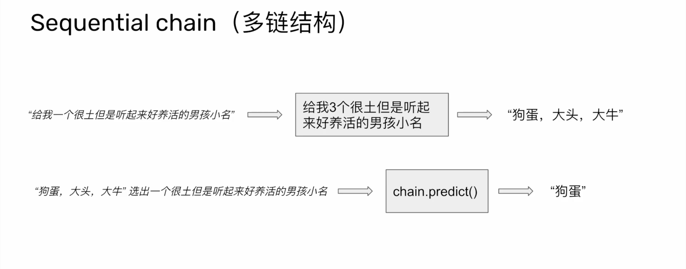

# 鏈式結構

什么是链结构?
概念上,链是在规定的标准下,不同模块的组合。

- 链是一个抽象出来的概念/标准,并不是一定要用链才能完成对LM的调用。
- 链提高了模块的标准化,复用性。
- 链增加了工程的复杂度,冗余度。

## 链结构分类

基础链结构

- LLM chain
- Router chain
- Sequential chain
- Transformation chain

应用链结构实例

- Document chains
- Retrieval QA

## LLM chain(单链结构)

- 定义prompt
- 定义Im
- 定义chain
- 运行predict

最少一次 LLM call

## Router chain(路由链结构)

Router chain

- 定义prompts
- 定义IIms/embeddings
- 定义chain(多链并行,选择一条链处理)
- 运行predict
- 最少2次LLMcall
- 要定義 chain 的特性，來做選擇

## Sequential chain(串行链结构)

- 定义prompts
- 定义IIms/embeddings
- 定义chain(多链串型,按照顺序执行)
- 运行predict
- 最少2次LLMcall

## Transformation chain(转换链结构)

不一定要調用大語言模型

## Document chains(文档链结构)

- Stuff
- Refine
- Map reduce
- Map rerank

## Stuff

不對文本做裁減

## Refine

切分文本
每一輪的輸入是上一輪的輸出

## Map reduce

MapReduce，這是一種編程模型，用於處理和生成大數據集的相關計算。這個模型通過兩個步驟來工作：Map（映射）步驟將一個問題分解成許多小塊，然後對這些小塊並行運算；而Reduce（歸納）步驟則將這些運算的結果合併，形成完整的解答。MapReduce廣泛應用於分佈式計算系統，例如Google的分佈式數據處理，以及Apache Hadoop等開源軟體。

## Map rerank

ChatGPT
Map rerank 在 LangChain 的上下文中是傳統 map-reduce 概念的一種變體。它涉及到在每一塊數據上運行一個初始提示（prompt），這個提示不僅嘗試完成一項任務，還會給出對其回答的信心分數。然後根據這個分數對回應進行排名，並返回得分最高的回應。這在期望結果為單一“最佳”輸出的場景中非常有用，比如推薦型任務​​​​。

LangChain 是一個便於批次處理文本的工具。在 map rerank 中，它利用語言模型的能力，不僅在數據塊上處理文本，還可以根據模型對其回應的信心分數來精煉輸出​​。特別是，map rerank 文檔鏈路會在每個文檔上運行一個初始提示，通過對每次嘗試進行打分，它可以確定哪個回應對於給定任務最可能是準確或有用的​​。

總的來說，map rerank 是 LangChain 工具套件中的一部分，它通過將信心評分整合到處理和分析文本數據的過程中，增強了提示工程的功能。這允許對數據輸出進行更智能的排序和選擇，這對於依賴於從大型數據集中提取最高質量信息的應用程序來說至關重要。
