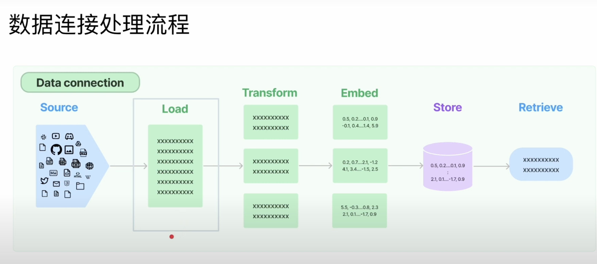
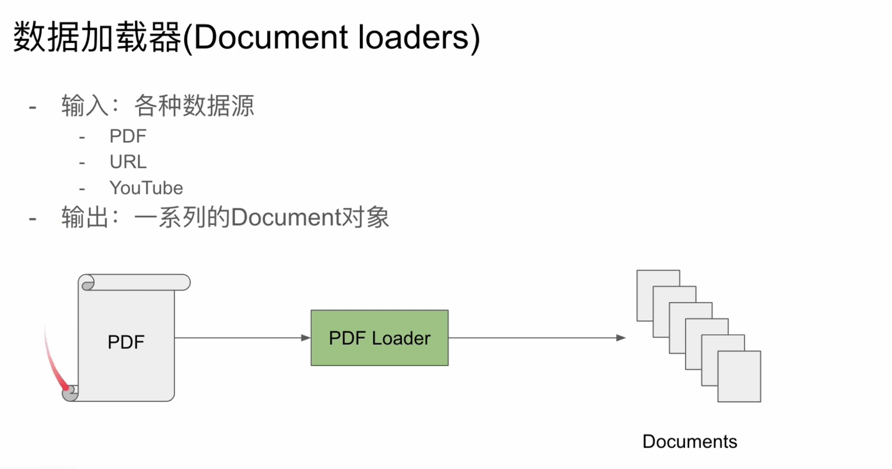
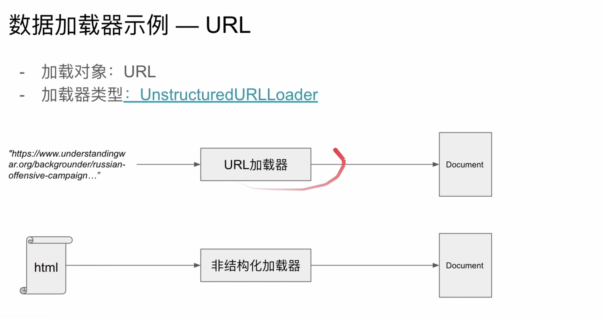
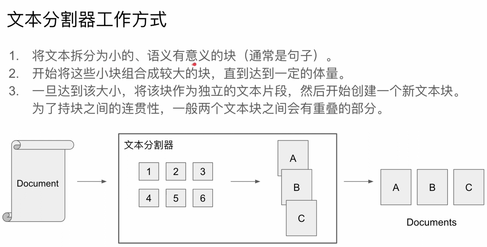
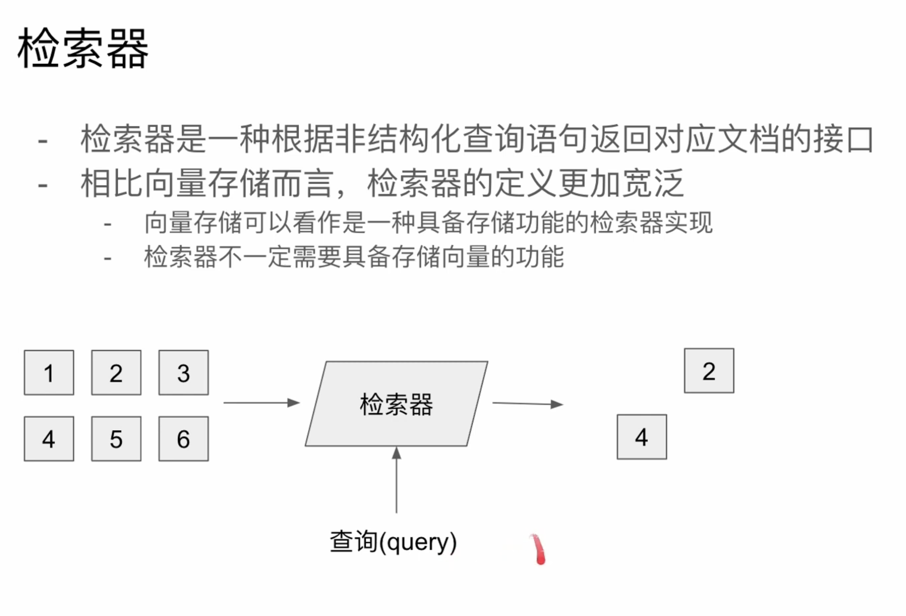

# 數據連接

数据连接
一些基于大型语言模型的应用经常需要用到模型数据集中没有的数据。针对这一需
求,Langchain提供了一系列的工具可让你从各种数据源中加载新的数据,转换数据,储存数据以及访问数据

- 文档加载器:从多种不同的数据源加载文档
- 文档转换器:拆分文档、丢弃冗余文档等
- 文本embedding:模型将非结构化文本转化为浮点数的列表
- 向量存储站:存储和搜索embedding数据
- 检索器:查询向量数据

---

---

- 結構化文件：CSV
- 非結構化文件
  - 純文本
  - ppt
  - html
  - pdf
  - 圖片

---

## 文档转换器

一旦加载了文档,通常会希望对其进行转换,从而更好地适应应用场景
最简单的例子是可能希望将长文档拆分为较小的块,以避免大型语言模型对于提手
词文本长度的限制
LangChain具有许多内置的文档转换器,可以轻松地拆分、合并、过滤文档。

## 文档转换器一文本分割器

- 分割长文本
- 分割策略:
  - 根据语义相关性把有关联的文本放在同一个分割段中

---

---

## 文本词嵌入(Word Embedding)

- 词嵌入是词语的一种数值化表示方式,一般情况下会将一个词映射到一个高维的向量中(词向量vector)
  - 例子
    - ”我”->[0,0.3,-0.1]
    - “你"->[-0.6,0.12,0.16]
    - “俺"->[0.01,0.298,-0.99]
- 不再考虑单词或者句子,对象变成了高维向量->数字化表达
- 接近的语义=接近的高维距离
- 把文本变成高维向量:嵌入模型
  - openAl
  - Cohere
  - Hugging Face

